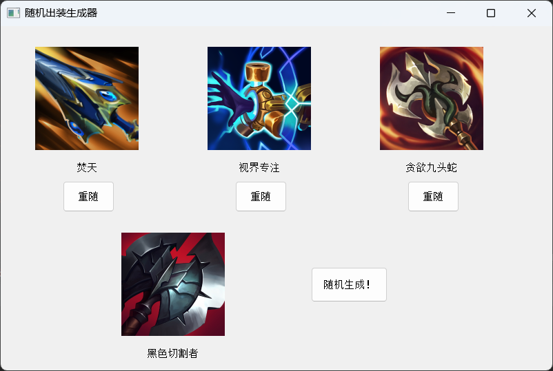
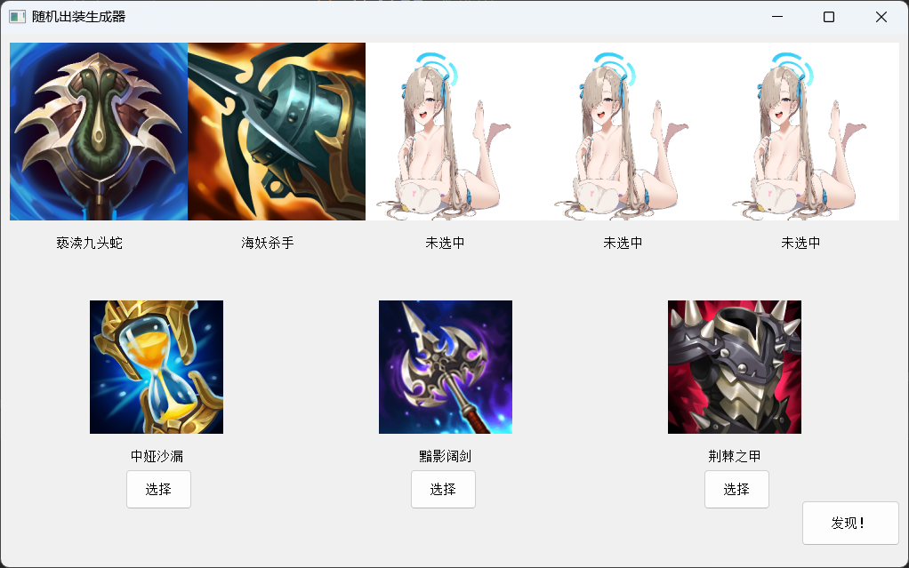

# 英雄联盟随机出装生成器

还在为你索然无味的游戏对局感到失望吗？

还在为想不出什么新的出装思路而烦恼吗？

还在为没有什么有趣的开黑点而叫不到人而感到无力吗？

那就快来试试这一个英雄联盟随机出装生成器吧！

采用最新的深度学习的思想，通过一键随机生成不同的出装思路，帮助你逃离出装固定思维，逃离局部最优解，拥抱全局最优的无限可能！

### 环境

基本库使用情况：

- python 3.7
- PyQT5 5.15.10
- opencv 4.5.3.56
- numpy 1.21.6

版本估计并不会有太多的限制，pip会自动安装最优的库版本。具体的依赖包可以查看requirements.txt这一文件，pip安装方法如下：

```cmd
pip install -r requirements.txt
```

### 功能

现版本为V2，里面含有两种随机生成方式：

1. 第一种为云顶海克斯的想法，采用1固定+3重随+flex位的生成方式，即生成一个固定装备A和三个可重新随机的装备BCD，你可以根据情况在BCD三个装备中进行重新随机。界面如下：

   

   在随机生成之后，左下角为固定的装备，而上方三个可以根据自己的英雄进行一部分的微调，并留下一个flex位，用于面对对面的特定阵容，防止过于被动。

2. 第二种为顺序选择方式，你需要在每次生成的三个随机装备中选取一个，用于打造你的出装路线。

   

   上一行为待定的五个装备，你将根据下面随机产生的三个装备逐步打造你的出装路线，并需要按出现顺序进行出装。（asuna的图片为未选中时的待定图片。）发现按钮可以进行清零。

### 使用方法

项目目录中有三个版本，V1为全随机，V2的两个版本则是在其基础上有所改进，使用方法都是一致的，从每个py文件中的main方法进入即可。

装备目录.txt文件与EquipIco文件夹中的装备图标是一一对应的，若找不到，则会统一显示asuna的图片，如果想进行不同的随机，也可以对其进行更改实现其他的随机。

若想分享给没有python环境的群友，则可以通过pyinstaller对其进行打包，生成exe文件。

### 后续优化思路

群友用完直说好，输了一晚求改造；改完V2意识到，正常出装才是救赎之道。

由于胜率没有丝毫起色，过于追求科研反而导致对局没有任何起色，反而会陷入过拟合。因此优化暂停，除非群友们有了合理的随机出装想法。

<div align='right'>暂停时间：2024.3.17</div> 

### 打包命令


合并打包
```cmd
pyinstaller.exe -F -w V2_frombeizi.py 
```
分开打包
```cmd
pyinstaller.exe -D -w -i icon.ico V2_fromjiaozi.py 	
```


<div align='right'>最后修改时间：2024.3.14</div> 
